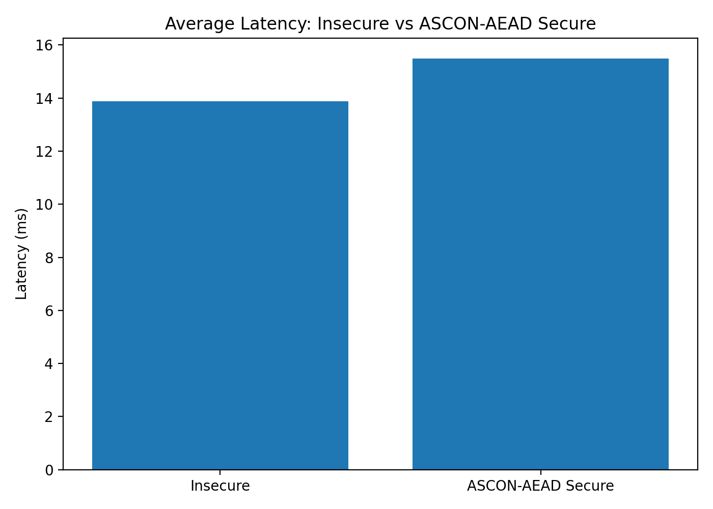
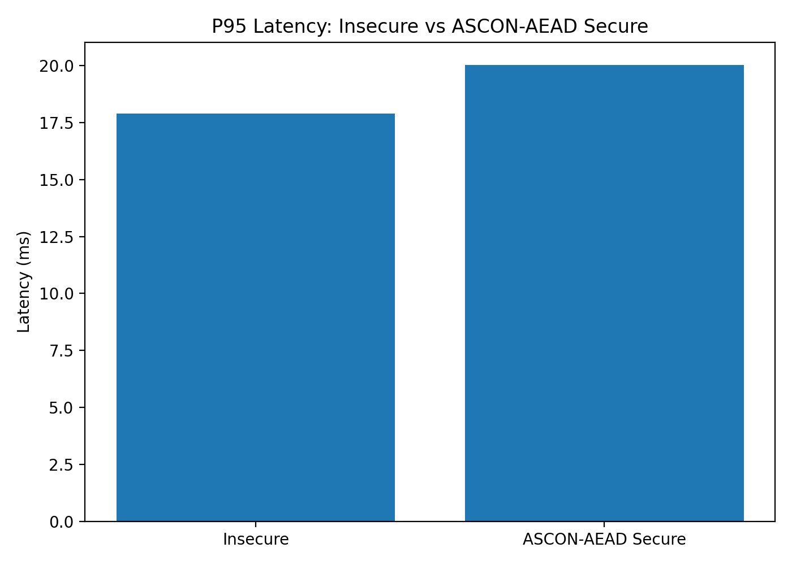
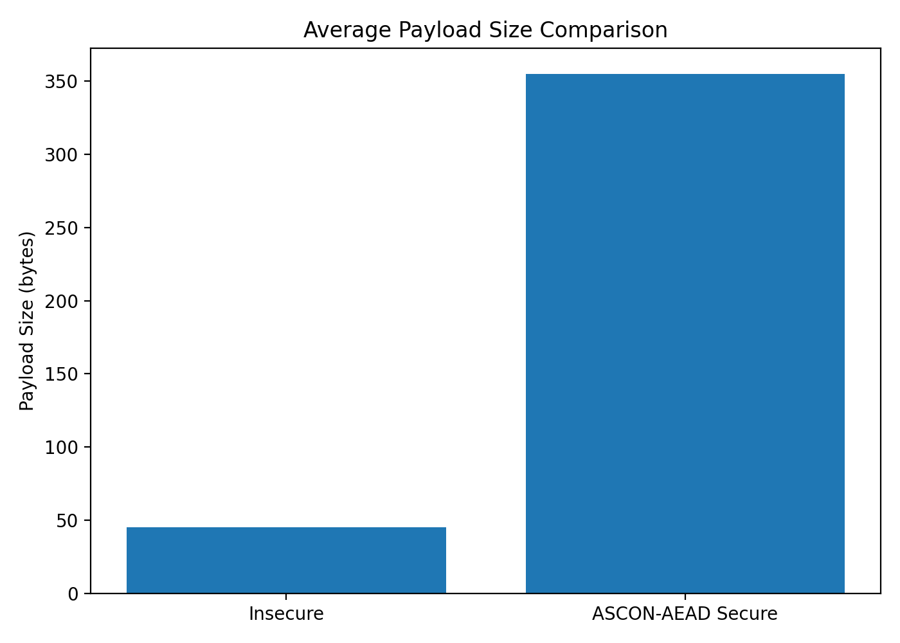
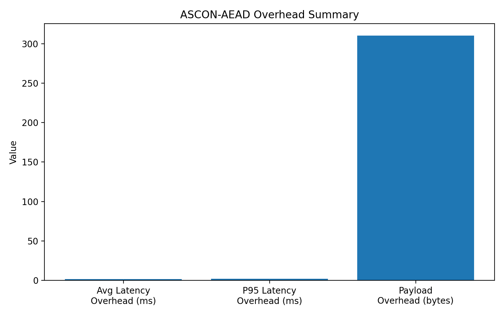

# ASCON-AEAD Secure Gateway Benchmark Report

## Overview

Dokumen ini berisi hasil benchmark antara endpoint insecure (plaintext HTTP payload) dan endpoint secure yang menggunakan ASCON-AEAD sebagai lightweight authenticated encryption layer pada Docker-based secure gateway.

Tujuan benchmark adalah untuk mengukur:

- latency overhead akibat enkripsi ASCON-AEAD,
- payload overhead,
- success rate komunikasi secure,
- performa secure gateway secara umum.

---

# Test Environment

| Component | Specification |
|---|---|
| Operating System | Ubuntu WSL |
| Container Runtime | Docker Compose |
| Gateway Framework | FastAPI |
| Internal WebApp | Flask |
| Encryption Algorithm | ASCON-AEAD128 |
| Request Count | 50 requests per scenario |
| Communication Model | HTTP over Docker Network |

---

# Benchmark Scenarios

## Scenario 1 — Insecure Communication

Client mengirim username dan password secara plaintext melalui endpoint:

```http
/insecure/auth/login
```

Payload:

```json
{
  "username": "admin",
  "password": "admin123"
}
```

---

## Scenario 2 — Secure ASCON-AEAD Communication

Client mengenkripsi payload menggunakan ASCON-AEAD sebelum dikirim ke gateway melalui endpoint:

```http
/secure/auth/login
```

Payload yang dikirim:

```json
{
  "ciphertext": "...",
  "nonce": "...",
  "tag": "...",
  "aad": {...}
}
```

Sistem menerapkan:
- confidentiality,
- authentication tag verification,
- associated data validation,
- replay protection,
- tampered ciphertext rejection.

---

# Benchmark Result

| Metric | Insecure | Secure ASCON-AEAD |
|---|---:|---:|
| Requests | 50 | 50 |
| Success Rate | 100% | 100% |
| Average Latency | 13.874 ms | 15.490 ms |
| Min Latency | 11.939 ms | 13.714 ms |
| Max Latency | 30.534 ms | 20.794 ms |
| P95 Latency | 17.905 ms | 20.028 ms |
| Average Payload Size | 45 bytes | 355 bytes |

---

# Overhead Analysis

| Metric | Value |
|---|---:|
| Average Latency Overhead | 1.616 ms |
| P95 Latency Overhead | 2.123 ms |
| Payload Overhead | 310 bytes |

---

# Benchmark Visualization

## Average Latency



---

## P95 Latency



---

## Payload Size Comparison



---

## Overhead Summary



---

# Security Validation

Selain benchmark performa, sistem juga berhasil membuktikan beberapa fitur keamanan tambahan:

| Security Test | Result |
|---|---|
| Replay Attack | Rejected |
| Tampered Ciphertext | Rejected |
| Authentication Tag Validation | Successful |
| Plaintext Exposure on Secure Endpoint | Not Visible |
| Plaintext Exposure on Insecure Endpoint | Visible |

---

# Traffic Analysis Result

Hasil analisis Wireshark menunjukkan bahwa endpoint insecure masih memperlihatkan username dan password dalam bentuk plaintext.

Sebaliknya, endpoint secure hanya memperlihatkan:
- ciphertext,
- nonce,
- authentication tag,
- associated data.

Hal ini membuktikan bahwa confidentiality berhasil diterapkan pada komunikasi client-server.

---

# Conclusion

Hasil benchmark menunjukkan bahwa implementasi ASCON-AEAD pada Docker-based secure gateway memberikan tambahan overhead rata-rata sekitar 1.616 ms dibandingkan komunikasi insecure biasa.

Walaupun payload meningkat karena adanya nonce, authentication tag, dan associated data, sistem tetap mempertahankan success rate 100% serta berhasil menambahkan:

- confidentiality,
- integrity verification,
- replay protection,
- authenticated communication.

Berdasarkan hasil pengujian, ASCON-AEAD dapat digunakan sebagai lightweight authenticated encryption mechanism untuk secure communication pada containerized web services dengan overhead performa yang relatif rendah.
